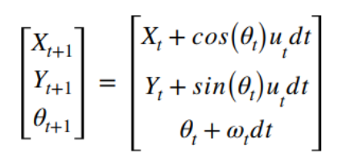

# EstimationTheory
Estimation of vehicle and obstacles positions using Extended Kalman and Particle filters

## Summary

  - [Description of the problem](#description-of-the-problem)
  - [Description of the repository](#description-of-the-repository)
  - [Requirements](#requirements)
  - [Usage](#usage)
  - [Results](#results)
  - [Acknowledgments](#acknowledgments)

## Description of the problem
Suppose  vehicle move in plane (2 dimensions). The vehicle is monitored by a fixed radar on the same plane as the vehicle. 
The estimator should calculate each time the best estimate for the position and orientation of the vehicle. The vehicle’s motion model is given by Eq.

While the radar measurement model is given by the equation:

Where Xo and Yo are the radar coordinates. The noise entering the measurement system is Gaussian with mean 0 and standard deviation σ.

### Task 1: 
Estimate the 3 states of the vehicle at each moment using radar data. The estimate should be done with:
  - 1.1 Extended Kalman Filter 
  - 1.2 Particle filter.

### Task 2:
A 2nd radar is added to the problem which is placed in a distance of 10m on the x-axis from the 1st radar. Repeat the estimates as in the 1st question but now using both radars at the same time.
  - 2.1 Extended Kalman Filter 
  - 2.2 Particle filter.

### Notes
- Sampling is done at a frequency of 10 Hz. 
- The file control.dat contains the measured readings of velocity u and ω with noise with a standard deviation of 0.05 and 0.1 respectively.
- The radar1.dat contains the noisy measurements of the vehicle from the second radar (d1, φ1). The noise of the first radar has a mean value of 0 and a standard deviation of 0.2rad at angle and 1m in distance measurement. 
- The radar2.dat file contains the noisy measurements of the vehicle from the second radar (d2, φ2). The noise of the second radar has mean value 0 and standard deviation 0.05rad in the angle and 0.3m in the measurement of distance. 

## Report

  

## Description of the repository

## Usage

    
## Acknowledgments
https://en.wikipedia.org/wiki/Kalman_filter

https://en.wikipedia.org/wiki/Extended_Kalman_filter

https://github.com/rlabbe/Kalman-and-Bayesian-Filters-in-Python/blob/master/12-Particle-Filters.ipynb

https://github.com/AlexandrosPetropoulos/EstimationTheory

Nummiaro, Katja, Esther Koller-Meier, and Luc Van Gool. "An adaptive color-based particle filter." Image and vision computing 21.1 (2003): 99-110.

    
